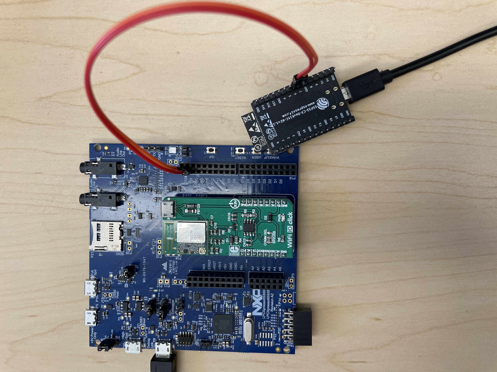
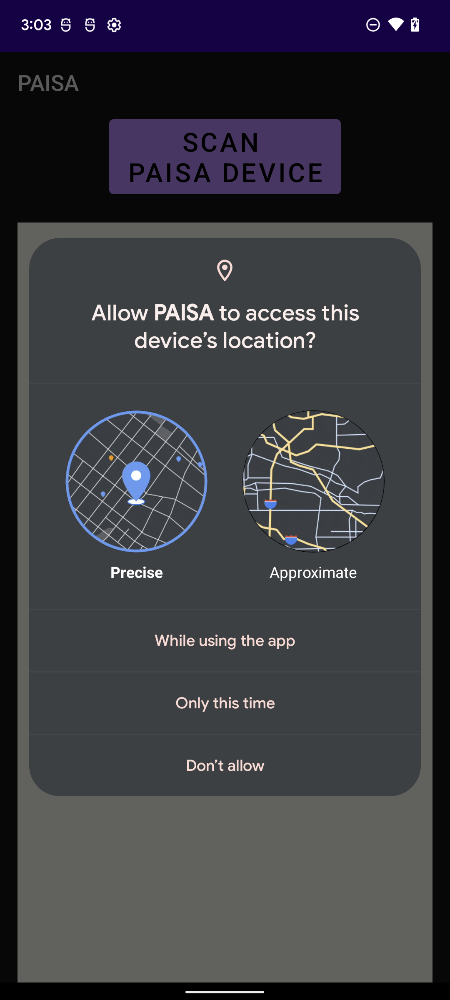
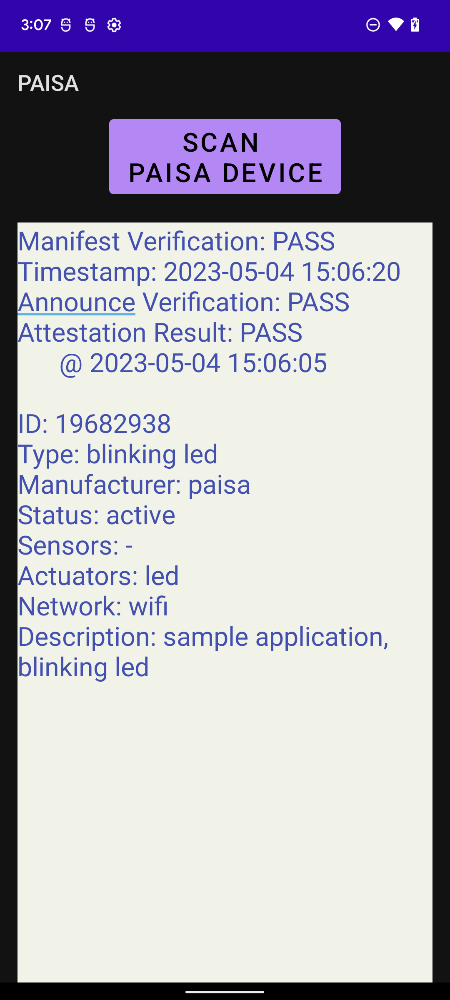

# Caveat (IoT) Emptor: Towards Transparency of IoT Device Presence

**[THIS REPOSITORY IS UNDER CONSTRUCTION]**

As many types of IoT devices worm their way into numerous settings and many aspects of our daily lives, awareness of their presence and functionality becomes a source of major concern. Hidden IoT devices can snoop (via sensing) on nearby unsuspecting users, and impact the environment where unaware users are present, via actuation. This prompts, respectively, privacy and security/safety issues. The dangers of hidden IoT devices have been recognized and prior research suggested some means of mitigation, mostly based on traffic analysis or using specialized hardware to uncover devices. While such approaches are partially effective, there is currently no comprehensive approach to IoT device transparency. 

In part, motivated by recent privacy regulations (GDPR and CCPA), this paper motivates the need for, and constructs, a \privacyaware\ Root-of-Trust architecture for IoT devices, called \paisa: <u>P</u>rivacy-<u>A</u>ware <u>I</u>oT <u>S</u>ensing and <u>A</u>ctuation. It guarantees timely and secure announcements about IoT devices' presence and their capabilities. \paisa has two components: one on the IoT device that guarantees periodic announcements of its presence even if all device software is compromised, and the other that runs on the user device, which captures and processes announcements.  Notably, \paisa requires no hardware modifications; it uses an off-the-shelf Trusted Execution Environment (e.g., ARM TrustZone).  This work also comprises a fully functional (open-sourced) prototype implementation of \paisa, which includes: an IoT device that makes announcements via IEEE 802.11 WiFi beacons and an Android smartphone-based app that captures and processes announcements. Both security and performance of \paisa design and prototype are discussed. 

## PAISA Directory Structure

    PAISA
    ├── 1_IoTDev
    │   ├── 1_NXPBoard
    │   │   ├── freertos_blinky_ns
    │   │   │   ├── drivers
    │   │   │   ├── freertos
    │   │   │   ├── nsc_functions
    │   │   │   ├── source
    │   │   │   └── startup
    │   │   └── freertos_blinky_s
    │   │       ├── include
    │   │       ├── drivers
    │   │       ├── mbedtls
    │   │       ├── nsc_functions
    │   │       ├── source
    │   │       └── startup
    │   └── 2_ESP32-C3
    │       └── main
    ├── 2_ManufacturerServer
    │   └── keys
    └── 3_AndroidPhone/
        └── app
            └── src
                └── main
                    ├── java
                    │   └── com
                    │       └── sprout
                    │           └── paisa
                    └── res
                         └── layout

## Hardware and Software Requirement

### Hardware Requirement

#### IoT Device
1. [NXP LPC55S69 board](https://www.nxp.com/design/software/development-software/mcuxpresso-software-and-tools-/lpcxpresso-boards/lpcxpresso55s69-development-board:LPC55S69-EVK) (based on Cortex-M33 equiped with Trustzone-M)
2. [ESP32-C3-DevKitC-02](https://docs.espressif.com/projects/esp-idf/en/latest/esp32c3/hw-reference/esp32c3/user-guide-devkitc-02.html)

PAISA on the IoT side is working on the NXP board. To support the WiFi interface, the board is physically connected with the WiFi module, the ESP board.

  

<b>Figure 1 - PAISA hardware connection between NXP board and ESP board</b>

The NXP board (big) is wired with the ESP board (small). UART4 on the NXP board is connected to UART 1 on the ESP board. Each board is powered individually.

#### Manufacturer Server (<i>mfr</i>)
Environment (processor and OS) used for development emulating PAISA Manufacturer Server:
11th Gen Intel® Core™ i5-11400 @ 2.60GHz × 12, Ubuntu 22.04.2 LTS.

#### User Device
We used the below two Android phones for emulating PAISA user device.
1. [Google Pixel 6](https://store.google.com/intl/en/ideas/articles/google-pixel-6-features/), running on Android 12 (API Level: 32)
2. [BLU View 1](https://store.google.com/intl/en/ideas/articles/google-pixel-6-features/), running on Android 9 (API Level: 28)

### Software Requirement
Each device, besides <i>mfr</i>, requires SDK and development tool for the development.

#### NXP Board
1. IDE: [MCUXpresso IDE v11.6.1](https://www.nxp.com/design/software/development-software/mcuxpresso-software-and-tools-/mcuxpresso-integrated-development-environment-ide:MCUXpresso-IDE) (released on 2022-10-03)
2. SDK: v2.12.0 (released 2022-07-14)

SDK can be built using [MCUXpresso SDK Builder](https://mcuxpresso.nxp.com/en/welcome), or it can be downloaded via MCUXpresso IDE. 
Note that the PAISA implementation on the NXP board is based on the secure_gpio example, provided by NXP.

##### Secure Configuration (Trustzone-M)
The following peripherals, memory regions (flash and RAM), interrupts are configured as secure:
- Peripherals
    - CTimer2 - a secure timer
    - FlexComm4 - a secure network peripheral for UART4
    - HashCrypt - a hardware accelerator for SHA256
    - Casper - a hardware accelerator for ECDSA schemes
- Memory
    - RAM - 0x3000_0000 ~ 0x3002_FFFF, 192KB
    - Flash - 0x1000_0000 ~ 0x1003_FDFF, 260KB
- Interrupt
    - CTimer2
    - FlexComm4

For more details about how to use IDE, please refer to [MCUXpresso IDE User Guide](https://community.nxp.com/pwmxy87654/attachments/pwmxy87654/Layerscape/4742/1/MCUXpresso_IDE_User_Guide.pdf).

#### ESP Board
The details about the ESP board is described [here](https://docs.espressif.com/projects/esp-idf/en/latest/esp32c3/hw-reference/esp32c3/user-guide-devkitc-02.html).
- IDE: [VSCode Extension](https://github.com/espressif/vscode-esp-idf-extension/blob/master/docs/tutorial/install.md), v1.6.1

#### Manufacturer Server (<i>mfr</i>)
<i>mfr</i> does not have any dependencies with IDEs since it is written in Python 3.
The implementation has done with Python 3.10.6, and dependencies on Python are:

        python3 -m pip install python-mbedtls

#### User Device
Android phones are used for the implementation.

1. IDE: [Android Studio Electric Eel](https://developer.android.com/studio?gclid=Cj0KCQjwr82iBhCuARIsAO0EAZx86tt-PH0sm_VldmFgYjICExtL7QzRwLnZ7EHE4Xl-7W_frNJbqMIaAjfeEALw_wcB&gclsrc=aw.ds), built on January 20, 2023.
2. SDK: API 33 (Android 13.0, Tiramisu)

## Building/running PAISA binaries on each device
#### NXP Board
The project for the NXP board is composed of two projects, freertos_blinky_ns for Normal world (non-secure) and freertos_blinky_s for Secure world. 
To build binaries running on each world, click each project and click the button, build, in the following way:

1. binary for Normal world
        a. Click freertos_blinky_ns project.
        b. Click 'build' botton in Quickstart pannel located in bottom left, or click 'Project' tab - 'Build Project'.
        c. Click 'LS' on the left of 'Debug your project' in Quickstart pannel, and click 'attach to a running target using LinkServer'.

2. binary for Secure World
        a. Click freertos_blinky_s project.
        b. Click 'build' botton in Quickstart pannel located in bottom left, or click 'Project' tab - 'Build Project'.
        c. Click Debug on 'Debug your project' in Quickstart pannel, or click 
        d. If SWD Configuration popped up, just choose 'Device 0' and click 'OK' button.
        e. The device will be stopped at the first line of main function for the sake of Debugging. You can execute each line of code by clicking 'Step Into' (F5) or 'Step Over' (F6), or just run the code by clicking 'Resume' (F8).

Just make sure that the NXP board is powered from your laptop/desktop. (Check if /dev/ttyACMx is present in the case of Ubuntu.)

**Important Note**
To run the code on the NXP board successfully, there are a couple of things to be done in advance as follows:
* The NXP board is wired with the ESP board correctly.
* The ESP board is powered and runs with PAISA firmware of the ESP board.
* SSID/Password/IP address (SSID/PASSWORD/MFR_IP_ADDR) is set properly in the ESP source code.
* <i>mfr</i> runs PAISA software for it. 

#### ESP Board
Assuming that VSCode is used with the Espressif IDF extension, execute VSCode on the ESP source code, 1_IoTDev/2_ESP32-C3.
Command Palette ('View'-'Command Palette', or just press ctrl+shift+p) is used for the commands below in order:
1. ESP-IDF:Select port to use (COM, tty, usbserial)
        a. Click the port for the ESP Board (typically, /dev/ttyUSB* in Ubuntu)
        b. Click the directory containing the ESP source code.
2. ESP-IDF:Set Espressif Device Target
        a. Click the directory containing the ESP source code.
        b. Click 'esp32c3'
        c. Click 'ESP32-C3 chip (via ESP-PROG)'
3. ESP-IDF:SDK Configuration editor (menuconfig)
        a. Just to confirm the UART setting. (port number:1, communication speed:115200, RXD pin:7, TXD pin:6)
4. ESP-IDF: Build your project
5. ESP-IDF: Flash your project

Make sure that the ESP board is powered from your laptop/desktop before going through the above steps.

#### Manufacturer Server (<i>mfr</i>)
To run <i>mfr</i> PAISA software, type the command as below:

        python3 2_ManufacturerServer/ttp_time_srv.py

For the server to receive temperature data, type the command as below:

        python3 2_ManufacturerServer/temp_srv.py

If error occurs due to the address already in use, you may want to figure out if the software is already running; otherwise, you need to change to port number on the file. (e.g. from 10000 to available port number)

#### User Device
We believe any Android phones running on Android Pie or later can be used for the user device, but 'Google Pixel 6' and 'BLU View 1' are verified for the implementation.

Developer options should be enabled to download the app from Android Studio directly. Also, USB debugging option is required.

In Android Studio, the Android phone connected to your laptop/desktop appears to 'Device Manager' - 'Physical'. Then follows the next steps:
1. Click the botton, located at top center, to choose your device to connect.
2. Click the botton next to the botton in step 1 to run the code to the chosen device.
3. After the app run on the phone, click 'SCAN PAISA DEVICE' button to start scanning the PAISA-enabled IoT devices.
4. If the app is executed first time after it is installed, it asks the location permission. The location permissions appeared on the phone can vary depending on Android version, but it is safe to choose 'Precise' location permission. (Relying on Android version, the pop up only shows 'Precise' permission)
5. All results will appear as depicted in the below figures.

  
  

<b>Figure 2 - PAISA Android app</b>

